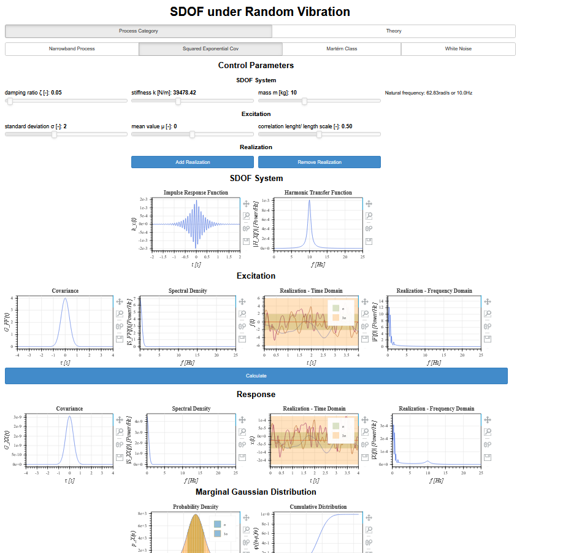

# SDOF System under Random Vibration

## Overview

This project is an interactive web application built with **Bokeh** to visualize the dynamic response of a **single-degree-of-freedom (SDOF) system** subjected to **Gaussian random excitation**.

The application allows users to explore how different stochastic excitation models influence the structural response in both the **time** and **frequency domain**, as well as related **probabilistic characteristics** such as failure likelihood.


App UI:



## Features

### System Modeling

* Linear SDOF system with:

  * mass ( m )
  * stiffness ( k )
  * damping ratio ( \zeta )
* Automatic computation of:

  * natural frequency
  * damped frequency
  * impulse response

---

### Stochastic Excitation

Gaussian processes with selectable covariance structures:

* Narrowband process
* Squared exponential covariance
* Matérn class
* White noise

User-controlled parameters:

* mean ( \mu )
* standard deviation ( \sigma )
* correlation length
* bandwidth and frequency

---

### Visualization

#### Time Domain

* Excitation realizations
* Response realizations
* Mean and confidence intervals (( \pm \sigma ), ( \pm 3\sigma ))

#### Frequency Domain

* Spectral density of excitation
* Transfer function of the system
* Response spectrum

#### Statistical Analysis

* Probability density function (PDF)
* Cumulative distribution function (CDF)

#### Failure Analysis

* Probability of survival
* First passage time
* Upcrossing rate (Poisson approximation)

---

## Project Structure

```
project/
│
├── main.py              # Application logic and callbacks
├── ui.py                # UI creation (widgets + plots)
├── calculations.py      # Structural mechanics functions
├── gaussian_process.py  # Stochastic process definitions
├── rfourier_utils.py    # Fourier transforms
├── shared/              # Latex rendering utilities
```

---

## Key Concepts

### Frequency Domain Response

The system response is computed using the transfer function:

[
X(f) = H_x(f) \cdot F(f)
]

---

### Stationary Gaussian Processes

The excitation is modeled as a stationary Gaussian process defined by:

* constant mean
* covariance function depending only on time lag

---

### Failure Modeling

Failure is evaluated using:

* upcrossing rate
* Poisson approximation

---

## Technologies Used

* Python
* NumPy / SciPy
* Bokeh (interactive visualization)
* Custom LaTeX rendering for mathematical descriptions

---

## How to Run

1. Open Anaconda Navigator
2. Go to Environments
3. Select your active environment (e.g. base)
4. Click on the green arrow → Open Terminal

In Terminal: 

1. cd path/to/your/project

2. bbokeh serve --show .

---

## Notes

* The application is intended for **educational and exploratory purposes**
* The stochastic models assume **second-order stationarity**
* The failure analysis is based on **approximate methods**

---

## Author

Antonia Schittich
MSc Civil Engineering – ETH Zürich


---
